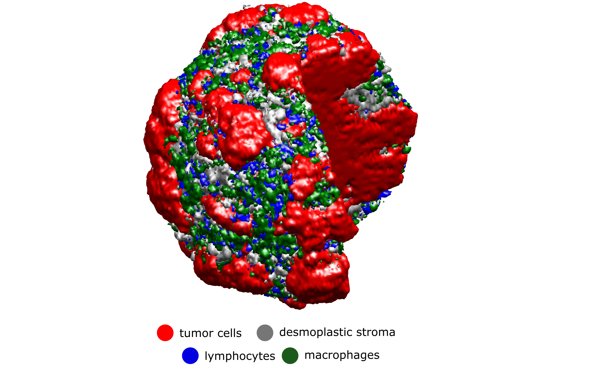

# immunoABM3D
3D agent-based model of human colorectal cancer

## About

This is a 3D on-lattice agent-based model of human colorectal cancer liver metastases that has been calibrated with clinical data. It includes tumor cells, lymphocytes, macrophages, stroma and necrosis.

The code will be explained in detail in a scientific publication. It is based on our previous publication:

Kather JN, Poleszczuk J, Suarez-Carmona M, Krisam J, Charoentong P, Valous NA, et al. In silico modeling of immunotherapy and stroma-targeting therapies in human colorectal cancer. Cancer Research. 2017; 77(22); 6442-52.

Please cite these papers if you re-use the code. 

## How to run / compile

The model engine was developed by Jan Poleszczuk and is implemented in C++. Via MEX, this can be used by the high-level Matlab functions. We provide a compiled version that can be used on a Windows machine (Windows 10). If you use another operating system, you can compile the code with the scripts provided in ./SIMengine. This requires SuiteSparse which is available at https://github.com/jlblancoc/suitesparse-metis-for-windows/
Furthermore, compilation of the code requires Eigen which is available here: http://eigen.tuxfamily.org/

## Licenses

The License for the source codes is available in the LICENSE file. The license for the external DLLs in ./SIMengine is available on Github at https://github.com/jlblancoc/suitesparse-metis-for-windows/

## Contact

Please feel free to contact Jakob Nikolas Kather or Jan Poleszczuk if you have any questions (Twitter: jnkath, JPoleszczuk). 